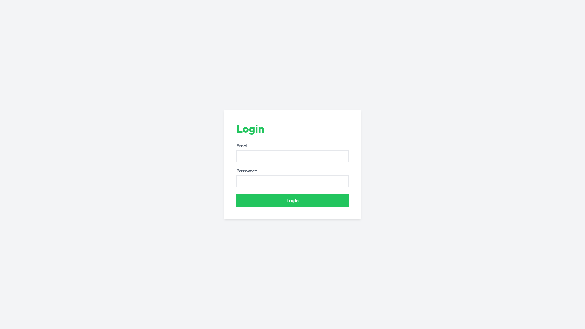
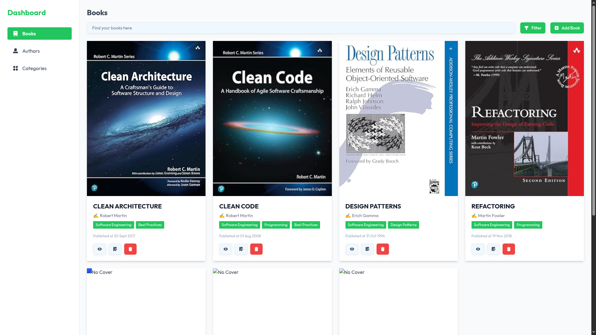
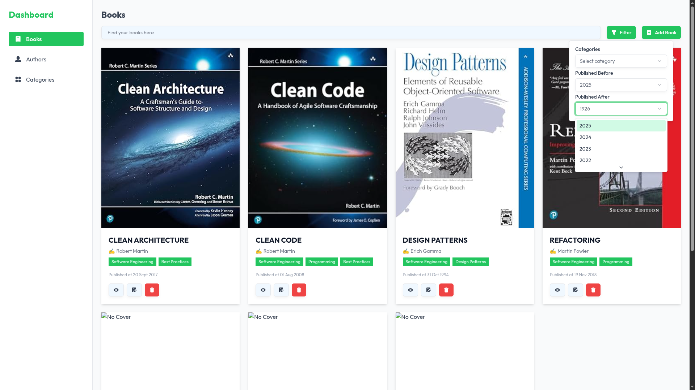
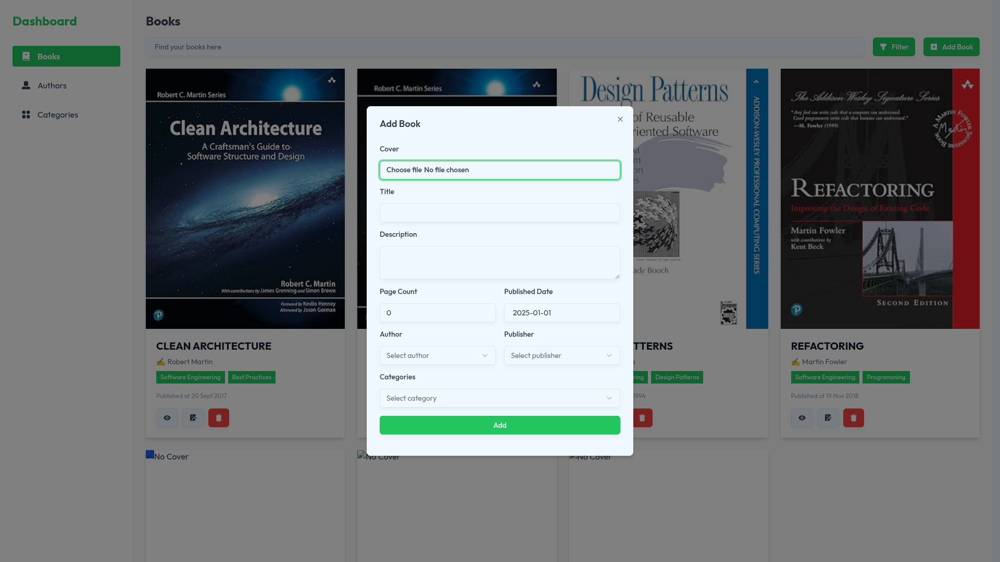
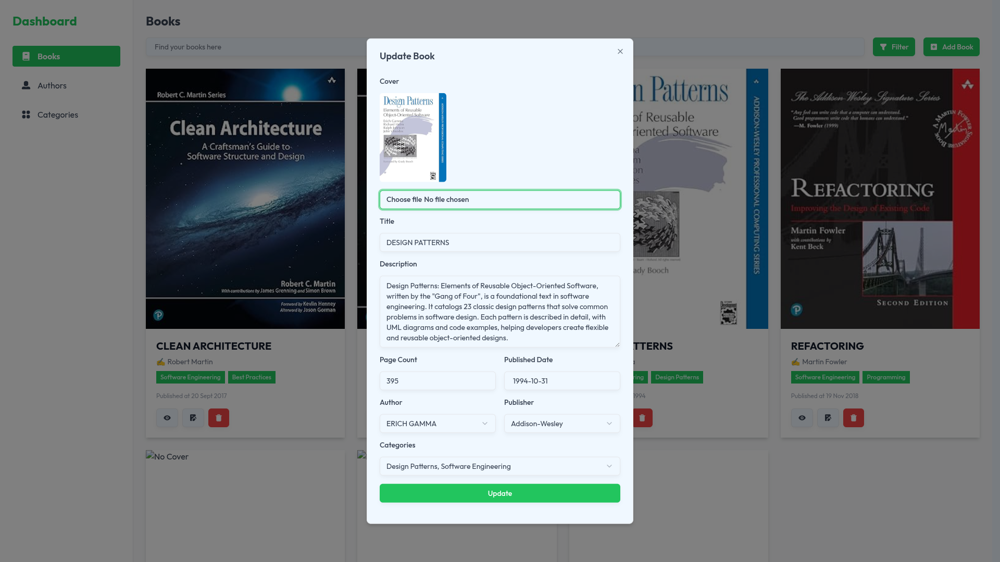
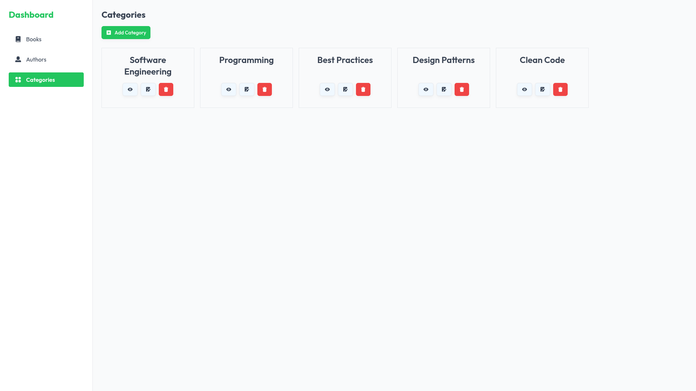
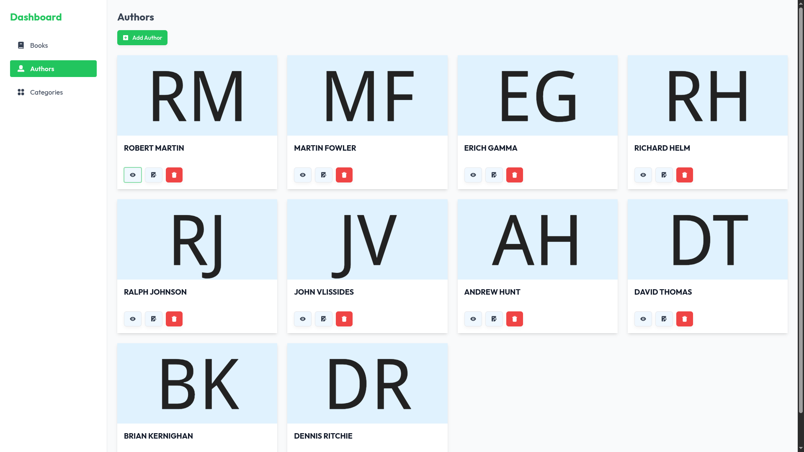

# 📚 Booklist — Aplikasi Manajemen Buku Interaktif

**Booklist** adalah aplikasi web modern untuk mengelola daftar buku, penulis, dan kategori secara efisien dan menyenangkan.  
Dilengkapi dengan tampilan UI yang bersih, fitur filtering canggih, dan manajemen data yang powerful! 🚀✨

---

## ✨ Fitur-Fitur Unggulan

- 📘 **Manajemen Buku**  
  Tambah, ubah, dan hapus data buku lengkap: judul, deskripsi, penulis, penerbit, tanggal publikasi.

- 🗂️ **Manajemen Kategori**  
  Kelola kategori buku dengan mudah.

- 🧑‍💼 **Manajemen Penulis**  
  Tambah dan kelola daftar penulis buku favoritmu.

- 📊 **Daftar Buku Interaktif**  
  Tabel buku yang bisa diurutkan dan difilter secara real-time.

- 🕵️ **Filter Canggih**  
  Filter berdasarkan kategori, teks (judul, penulis, penerbit), dan rentang tanggal publikasi.

- 🔐 **Otentikasi Pengguna**  
  Login sederhana untuk mengamankan fitur manajemen.

---

## 🖼️ Preview Antarmuka

### 🔑 Halaman Login
Tampilan awal untuk masuk ke sistem.


---

### 📋 Daftar Buku
Tampilan utama semua buku.


---

### 🔍 Filter Buku
Gunakan filter untuk mencari buku sesuai keinginanmu.


---

### ➕ Tambah Buku Baru
Formulir sederhana untuk menambah buku.


---

### 📝 Perbarui Buku
Edit data buku dengan cepat dan efisien.


---

### 🗃️ Daftar Kategori
Kelola semua kategori buku.


---

### ✍️ Daftar Penulis
Kelola penulis favoritmu di sini.


---

## 🛠️ Teknologi yang Digunakan

Project ini dibangun dengan teknologi modern untuk pengalaman development & performa terbaik:

| Teknologi        | Deskripsi                                          |
|------------------|----------------------------------------------------|
| 🧠 SvelteKit      | Framework web modern untuk membangun UI cepat      |
| 🔤 TypeScript     | Superset JavaScript dengan type-safety            |
| 🎨 Tailwind CSS   | Utility-first CSS framework untuk styling cepat    |
| 🧱 Shadcn Svelte  | Kumpulan komponen UI siap pakai berbasis Tailwind |

---

## 🚀 Cara Instalasi & Menjalankan

### 📋 Prasyarat

Pastikan sudah terpasang:

- [Node.js](https://nodejs.org/) atau [Bun](https://bun.sh/)
- Salah satu package manager: `npm`, `pnpm`, atau `bun`
- Backend API aktif (contohnya backend Go di `http://localhost:8000`)

---

### 🧑‍💻 Langkah-langkah Setup

1. **Clone repositori**

```bash
git clone https://github.com/ziruiproject/books-frontend.git
cd books-frontend
````

2. **Install dependensi**

```bash
# Menggunakan npm
npm install

# atau pnpm
pnpm install

# atau bun
bun install
```

3. **Jalankan aplikasi frontend**

```bash
# Dengan npm
npm run dev

# atau dengan bun
bun run dev
```

🎉 Aplikasi bisa diakses di `http://localhost:5173`

---

## 🔐 Kredensial Login (Demo)

Gunakan akun demo berikut untuk masuk ke dalam sistem:

```txt
Email    : sa@test.com
Password : rahasia123
```

---

## 🧭 Navigasi & Penggunaan

* 🔐 **Login** → Masuk ke sistem dengan kredensial di atas.
* 📚 **Books** → Lihat, filter, tambah, dan edit daftar buku.
* 🗃️ **Categories** → Kelola kategori buku.
* ✍️ **Authors** → Kelola daftar penulis.

Gunakan filter dan pencarian untuk mempersempit daftar sesuai keinginanmu 🔍

---

## 💡 Tips Tambahan

* ⏱️ Gunakan **live reload** dari SvelteKit untuk development cepat.
* 🌈 Ubah styling dengan **Tailwind** di `app.css`.
* 🔗 Pastikan koneksi ke backend stabil untuk interaksi optimal.

---

## 📬 Kontribusi

Pull request & issue sangat welcome! 🎉
Kalau kamu suka dengan project ini, kasih ⭐ dong di repo ini atau repo [backend-nya](https://github.com/ziruiproject/books-backend) ❤️

---

> Dibuat dengan ☕ dan semangat open source oleh [Yudha Sugiharto](https://github.com/ziruiproject)
